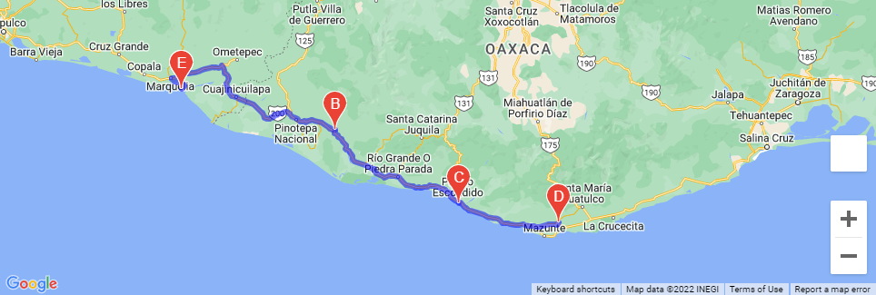
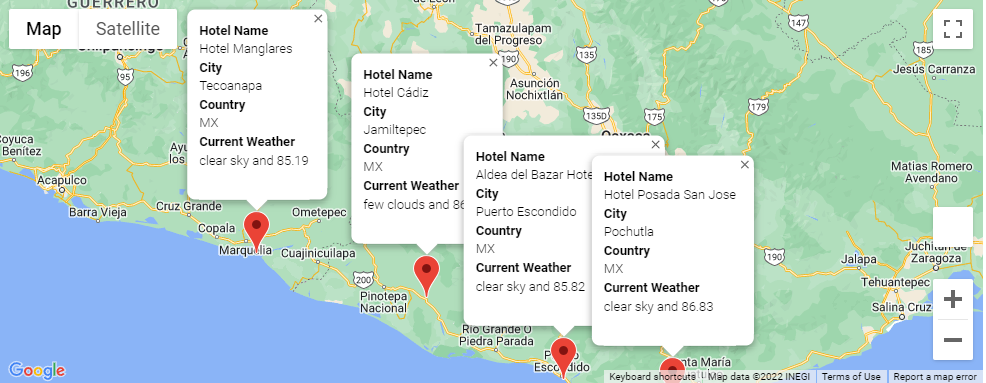

# World Weather Analysis

# Project Overview
Collect and analyze weather data across cities worldwide for PlanMyTrip app. Data will be utilized to recommend ideal hotels based on clients' weather preferences. In addition, a trip itinerary will be coded to include a stunning trip through the southern Mexican coast.

## Resources
[G Maps Documentation](https://jupyter-gmaps.readthedocs.io/en/latest/tutorial.html#directions-layer)

-----
# Process

### Code

This code was used to run an API and retrieve data.

    try:
        # Parse the JSON and retrieve data.
        city_weather = requests.get(city_url).json()
        # Parse out the needed data.
        city_lat = city_weather["coord"]["lat"]
        city_lng = city_weather["coord"]["lon"]
        city_max_temp = city_weather["main"]["temp_max"]
        city_humidity = city_weather["main"]["humidity"]
        city_clouds = city_weather["clouds"]["all"]
        city_wind = city_weather["wind"]["speed"]
        city_country = city_weather["sys"]["country"]
        # Convert the date to ISO standard.
        city_date = datetime.utcfromtimestamp(city_weather["dt"]).strftime('%Y-%m-%d %H:%M:%S')
        # Append the city information into city_data list.
        city_data.append({"City": city.title(),
                          "Lat": city_lat,
                          "Lng": city_lng,
                          "Max Temp": city_max_temp,
                          "Humidity": city_humidity,
                          "Cloudiness": city_clouds,
                          "Wind Speed": city_wind,
                          "Country": city_country,
                          "Date": city_date})

*Southern Mexican Coast Trip*

*Southern Mexican Coast Trip with Markers*

# Summary

This PlanMyTrip app has enormous potential, and can be expanded on in the future. Hotel information that can be iterated with weather data would be of possible interest to large hotel companies. 
